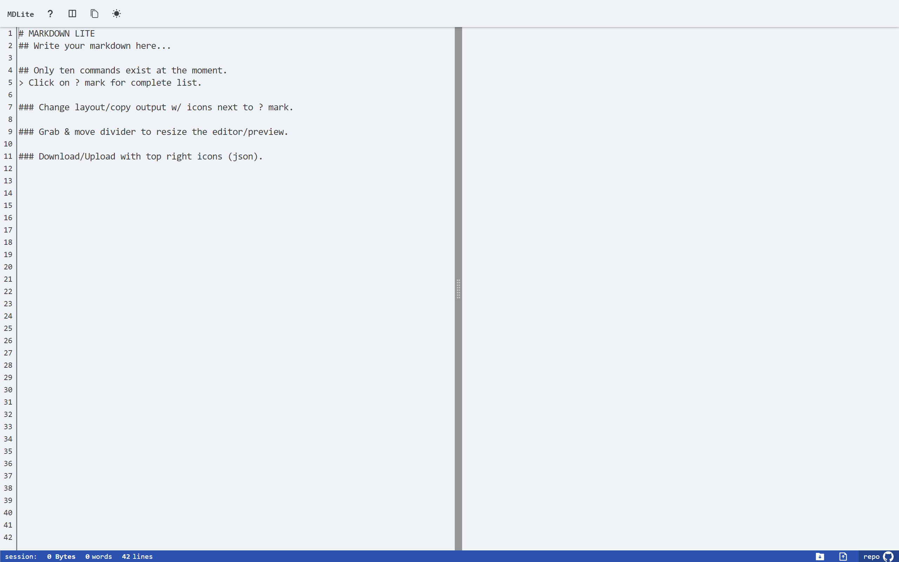

# markdown lite



## features

- Lighthouse: 100, 100, 100, 100
  - all themes adhere to contrast guidelines.
  - passes all accessibility checks.
  - tiny 50kb build.
  - avoids dangerouslySetInnerHTML.
- editor with real-time preview.
- preview scrolls with editor.
- switch between column/row layout.
- resize column/row layout.
- custom dynamic number line system.
- real-time file size.
- real-time word and line count.
- local storage.
- save and upload files.
- copy to clipboard.

### about

What separates this from many other react markdown editors is the avoidance of dangerouslySetInnerHTML and the ability to resize the editor/preview panels. It also incorporates a dynamic numbered line system (similar to notepad++), along with three contrast-accessible themes, local storage, and a file upload/download system.

Note that this is not traditional markdown. I've kept things limited to purely what I find useful/use most of the time.

Markdown expressions are rendered/represented as react elements. Aside from avoiding potential security risks, delivering content through an actual react element raises performance significantly. Using setDangerousHtml & then performing HTML sanitation goes against every core principle of react's reconciliation process.

## commands

```javascript
#                H1
##               H2
###              H3
*text*           bold
[link](url)      link
{url}            image
<code></code>    codeblock
>                blockquote
- unordered      list
___              linebreak
```
